# Credit Risk Analysis
## Overview
The purpose of this project is to run multiple tests to determine which is the most accurate for a bank to use to determine loan risk assessment for borrowers. This is done by using data from LendingClub and looking at six different tests that oversample, undersample, combination, reduce bias.

## Results

### RandomOverSampler model

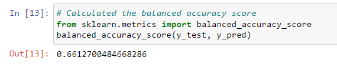
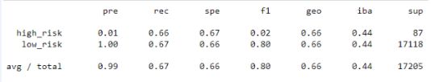

* The random over sampler model has an accuracy score of 66%.
* This model has a precision score of 1% with a sensitivity of 66% when it comes to high risk loans.
* This model has a precision score of 100% with a sensitivity of 67% when it comes to low risk loans.
* There appears to be a very high number of low risk loans compared to high risk.

### SMOTE model

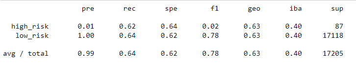

* The SMOTE model has an accuracy score of 63%.
* This model has a precision score of 1% with a sensitivity of 62% when it comes to high risk loans.
* This model has a precision score of 100% with a sensitivity of 64% when it comes to low risk loans.
* There appears to be a very high number of low risk loans compared to high risk just as in the previous model.

### ClusterCentroids model

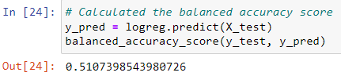
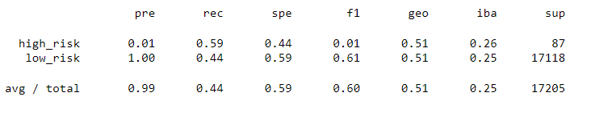

* The random over sampler model has an accuracy score of 51%, much lower than the other two models.
* This model has a precision score of 1% with a sensitivity of 59% when it comes to high risk loans. This differs as well.
* This model has a precision score of 100% with a sensitivity of 44% when it comes to low risk loans. This is a drastic drop in sensitivity.
* Just as before there is a very high number of low versus high risk loans.

### SMOTEENN model

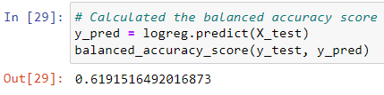
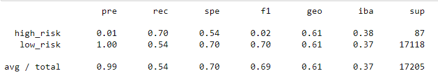

* The random over sampler model has an accuracy score of 61%.
* This model has a precision score of 1% with a sensitivity of 70% when it comes to high risk loans.
* This model has a precision score of 100% with a sensitivity of 54% when it comes to low risk loans.
* As the other models the high versus low risk remains the same. It will no longer be discussed unless there is a different result.

### BalancedRandomForestClassifier model

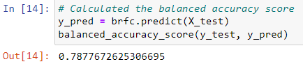
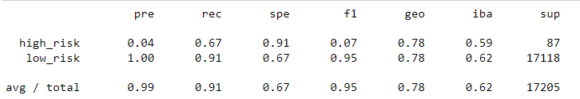

* The random over sampler model has an accuracy score of 78%.
* This model has a precision score of 4% with a sensitivity of 67% when it comes to high risk loans.
* This model has a precision score of 100% with a sensitivity of 91% when it comes to low risk loans.

### EasyEnsembleClassifier model

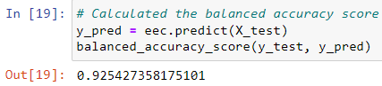
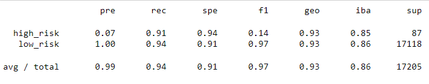

* The random over sampler model has an accuracy score of 92%.
* This model has a precision score of 7% with a sensitivity of 91% when it comes to high risk loans.
* This model has a precision score of 100% with a sensitivity of 94% when it comes to low risk loans.

## Summary
None of these models are able to accurately deteremine a borrowers credit risk. The one with the highest precision determining high risk and with the highest accuract would be the easy ensemble classifier model. Of course this model works to eliminate bias which is necessary when analysing any data. However, the precision score is still too low for these purposes and all models have 100% precision with low risk lenders. I would not recommend any of these models.
